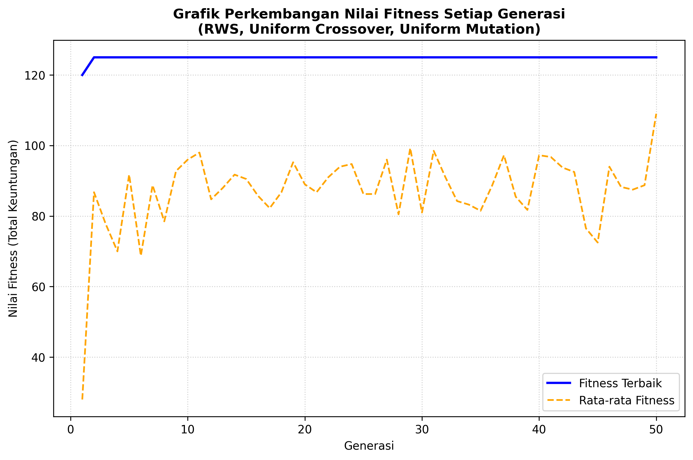

# H1D024102-PraktikumKB-Pertemuan10

Pengumpulan tugas praktikum Kecerdasan Buatan pertemuan 10.

## Implementasi Algoritma Genetika untuk 0/1 Knapsack Problem

Program ini mengimplementasikan Algoritma Genetika (Genetic Algorithm) untuk mencari kombinasi barang yang memberikan keuntungan maksimal dalam batas kapasitas penyimpanan gudang tertentu (0/1 Knapsack Problem).

Metode yang digunakan pada tahapan seleksi, crossover, dan mutasi disesuaikan dengan **dua digit terakhir NIM Mahasiswa (H1D024102)**.

---

### 1. Ketentuan Studi Kasus & Pemetaan Metode (NIM: H1D024102)

#### a. Data Barang & Kapasitas Gudang
* **Kapasitas Maksimal Gudang**: 15
* **Daftar Barang**:

| No | Barang | Keuntungan | Ukuran |
|----|--------|------------|--------|
| 1  | Barang1| 10         | 5      |
| 2  | Barang2| 40         | 4      |
| 3  | Barang3| 30         | 6      |
| 4  | Barang4| 50         | 3      |
| 5  | Barang5| 35         | 7      |

#### b. Pemetaan Metode Berdasarkan NIM `H1D024102`
* **Dua digit terakhir NIM**: `02`
* **Seleksi (Digit Pertama = 0)**: **Roulette Wheel Selection (RWS)**
* **Crossover (Digit Kedua = 2)**: **Uniform Crossover**
* **Mutasi**:
  * Penjumlahan dua digit NIM: $0 + 2 = 2$
  * Digit terakhir hasil penjumlahan: `2`
  * **Metode Mutasi (Digit Terakhir = 2)**: **Uniform Mutation (Bit Flip Mutation)**

---

### 2. Arsitektur Kode Program & Modul

Modul-modul dipisah secara independen untuk menjaga modularitas program:

| No | Modul | Fungsi Utama | Deskripsi |
|---|---|---|---|
| 1 | `InisiasiPopulasi.py` | `inisialisasi_populasi()` | Membangkitkan kromosom biner acak (gen biner: 1 dipilih, 0 tidak). |
| 2 | `EvaluasiFitness.py` | `hitung_fitness()` | Menghitung total keuntungan. Memberi penalti `0` jika total ukuran > 15. |
| 3 | `selection.py` | `roulette_wheel_selection()` | Memilih parent secara probabilistik berdasarkan porsi nilai fitness. |
| 4 | `crossover.py` | `uniform_crossover()` | Melakukan pertukaran gen antar parent secara acak (peluang 50% per gen). |
| 5 | `mutation.py` | `uniform_mutation()` | Melakukan mutasi bit-flip pada gen secara acak sesuai dengan nilai *mutation rate*. |
| 6 | `main.py` | `run_genetic_algorithm()` | Mengontrol alur utama algoritma genetika (CLI) dan memplot grafik perkembangan fitness. |
| 7 | `gui.py` | Kelas `GAApp` | Menyediakan antarmuka GUI interaktif berbasis **Tkinter** untuk memvisualisasikan parameter dan hasil simulasi. |

---

### 3. Alur Algoritma Genetika (Fungsi `run_genetic_algorithm()`)

1. **Inisialisasi**: Bangkitkan populasi awal secara acak (jumlah individu = 20).
2. **Evaluasi**: Hitung nilai fitness untuk setiap individu dalam populasi.
3. **Elitisme**: Salin 2 individu terbaik langsung ke populasi generasi berikutnya untuk mencegah hilangnya solusi terbaik.
4. **Seleksi**: Pilih pasang parent dari populasi saat ini menggunakan metode *Roulette Wheel Selection*.
5. **Crossover**: Lakukan perkawinan silang menggunakan metode *Uniform Crossover* dengan probabilitas `crossover_rate` (0.8) untuk membentuk anak.
6. **Mutasi**: Terapkan *Uniform Mutation* dengan probabilitas `mutation_rate` (0.1) pada setiap gen anak (bit-flip).
7. **Iterasi**: Masukkan anak ke populasi baru, ulangi hingga ukuran populasi tercapai. Ulangi proses evaluasi hingga batas generasi (50) terpenuhi.
8. **Output**: Tampilkan solusi terbaik, daftar barang terpilih, dan simpan grafik perkembangan nilai fitness.

---

### 4. Hasil Optimasi Terbaik (Kapasitas Gudang = 15)

* **Kromosom Terbaik**: `[0, 1, 0, 1, 1]` (Barang 2, Barang 4, Barang 5)
* **Total Keuntungan Maksimal**: **125**
* **Total Ukuran Gudang Terpakai**: **14** (di bawah kapasitas maksimal 15)

#### Contoh Output Grafik Perkembangan Fitness:


---

### 5. Cara Menjalankan Program

#### a. Instalasi Dependensi
Pastikan library `matplotlib` sudah terinstal:
```bash
pip install matplotlib
```

#### b. Menjalankan Mode CLI (Command Line Interface)
Jalankan program utama berbasis konsol untuk melihat perkembangan fitness per generasi dan menghasilkan file `grafik_fitness.png`:
```bash
python main.py
```

#### c. Menjalankan Mode GUI (Graphical User Interface)
Jalankan antarmuka grafis interaktif berbasis **Tkinter** untuk mengubah parameter secara fleksibel dan melihat hasil secara visual:
```bash
python gui.py
```
# H1D024102-PraktikumKB-Pertemuan10
